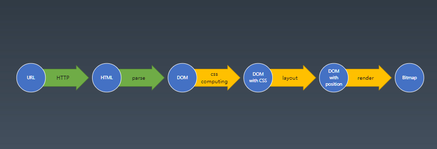

# 浏览器工作原理(一)



## Http 请求组成

```
POST / HTTP/1.1
Connection: keep-alive
Content-Length: 55
Content-Type: application/json

abc=123&bcd=%3A%3B
```

> 注：快速获取 Http 请求头原生报文方式，Network->右键->Copy->Copy request Headers

### ReuqestLine

```
POST    /       HTTP/1.1
method  path   httpVersion
```

> method 包含 OPTIONS GET POST HEAD PUT DELETE TRACE CONNECT

### Request Headers[POST method]

- **Content-Length**
  > 表示 body 内容长度
- **Content-Type**
  > 表示请求内容的类型
  - application/json
  - application/x-www-form-urlencoded
  - text/xml
  - multipart/formdata

### Body

```
application/x-www-form-urlencoded

abc=123&bcd=%3A%3B
```

```
application/json

JSON.stringify(json)
```

## HTTP 响应组成

```
HTTP/1.1 200 OK
Content-Type: application/json; charset=utf-8
Content-Length: 798

{"code":0,"data":{"list":[...]}}

```

### StatusLine

```
HTTP/1.1        200       OK
httpVersion statusCode statusText
```

### Response Headers

```
Content-Type: application/json; charset=utf-8
Content-Length: 798
```

- **Content-Type**
  > 响应内容的类型及编码方式
- **Content-Length**
  > 响应内容的长度
- **Transfer-Encoding**
  > 响应内容的传输格式

### Response Body

> 根据 Content-Type 和 Transfer-Encoding 等属性确定 Body

```
Content-Type为application/json：
{"code":0,"data":{"list":[...]}}

Transfer-Encoding为chunked时：
10 // chunk长度
1234567890 //chunk内容
0 // 内容结束
```

## 处理过程

### 请求处理过程

1. 创建 TCP 客户端
2. 向服务端发送 RequestLine、RequestHeaders、RequestBody
3. 监听服务端返回数据并处理

### 响应处理过程

1. 客户端接收到服务端返回数据
2. 利用状态机解析 ResponseStatusLine、ResponseHeaders
3. 根据 ResponseHeaders 中 Transfer-Encoding 决定采用哪种方式解析 ResponseBody
4. 利用状态机解析 ResponseBody
