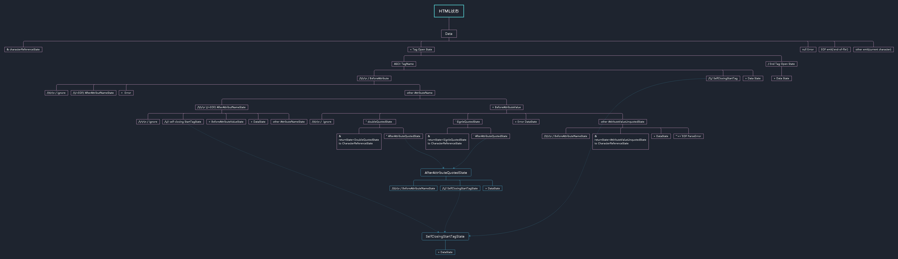

# 浏览器工作原理(二)

## HTML 解析

### 状态机解析 html 内容

1. 创建 FSM
2. 解析标签
3. 创建元素
4. 处理属性

### 构建 HTML 树结构

1. 创建栈
2. 遇到开始标签时入栈，遇到结束标签时出栈
3. 文本节点不入栈，多个文本节点需要合并
4. 将当前元素作为栈顶元素的子元素

# 有限状态机

- 每一个状态都是一个**机器**
  - 每个机器都是独立的单元，负责自身的数据处理逻辑
  - 所有机器输入一致
  - 每个机器本身没有状态，每个输入对应一个输出不受其他变量影响
- 每个机器知道下一个状态
  - 每个机器都有确定的下一个状态(Moore)
  - 每个机器根据输入决定下一个状态（Mealy）
