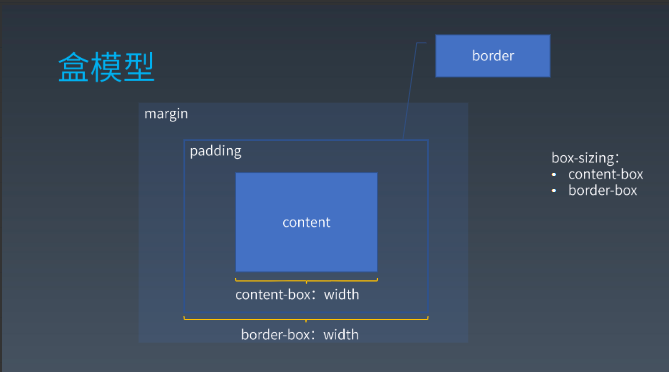

# 重学 CSS(二)

## 排版

### 盒

排版和渲染的基本单位是盒，元素在排版时可能产生多个盒

例 1：文字一行显示不下时会换行，排版中每一行是一个行盒，一个行盒中至少包含一个盒，同一个元素中多行文字就会产生多个盒

例 2：元素中包含::before,::after,::firstletter 伪元素，每个伪元素可以产生一个盒，则当前元素可以产生多个盒

### 盒模型

- Box-sizing: content-box
  - width = contenWIdth
- Box-sizing: border-box
  - width = contentWidth + padding + border

### 正常流

1. 收集盒进入行
   > 连续的行级元素依次进入行盒，当行盒容纳不下时将元素收集到下一个行盒
2. 计算盒在行中的排布
   > 左右排布、上下排布
3. 计算行的排布
   > 计算行高依次排布

- inline-block 要配合 vertical-align 使用，通常把 vertical-align 设为 top 或 bottom；
- 如果一行的有子元素的高度大于 line-height，行高为最大元素的高度；
- Display:inline-block, 对两个元素之间的空格会生效，导致出现空白边；

## BFC（块级格式上下文）

- 什么情况会产生 BFC
  - 能容纳正常流的元素都会产生 BFC，除 overflow：visible 外；
- Block-level boxes：flex、table、grid、block
  - 表示块级别的盒子
- block containers: block、inline-block
  - 表示正常流块级元素的容器
- block boxes：block
  - block-level && block-container
  - block box 如果 overflow 是 visible， 那么就跟父 bfc 合并

## margin 折叠

- 同一个 BFC 下 display:inline-block；的元素之间不会发生边距折叠
- 同一个 BFC 下脱离文档流的元素相互间不会发生边距折叠
- 不同 BFC 下的元素之间不会发生边距折叠
