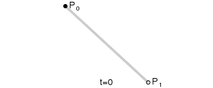
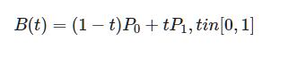
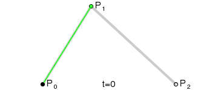
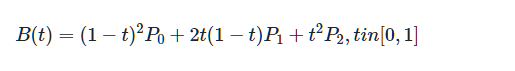
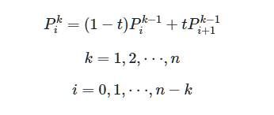

# 重学 CSS(三)

## animation

animation-name 时间曲线
animation-duration 动画的时长
animation-timing-function 动画的时间曲线
animation-delay 动画开始前的延迟
animation-iteration-count 动画播放次数
animation-direction 动画方向

## transition

transition-property 要变换的属性
transition-duration 变换的时长
transition-timing-function 时间曲线
transition-delay 延迟

## 贝赛尔曲线

### 一阶贝塞尔曲线

点在两点之间的直线上移动，位置与时间成正比

### 二阶贝塞尔曲线

- p1`、p2`分别沿 p0-p1、p1-p2 移动，位置与时间成正比
- pt 沿 p1`-p2`移动，位置与时间成正比

  pt 的轨迹即为二阶贝塞尔曲线

### 三阶贝塞尔曲线

- p1`、p2`、p3`分别沿 p0-p1、p1-p2、p2-p3 移动
- p1`、p2`分别沿 p1`-p2`、p2`-p3`移动
- pt 沿 p1`-p2`移动

  pt 的轨迹即为三阶贝塞尔曲线

## Tips

- Gpu 利用率越高 性能越好
- 减少 dom 操作
- 使用 transform 而非 left right 属性移动元素
