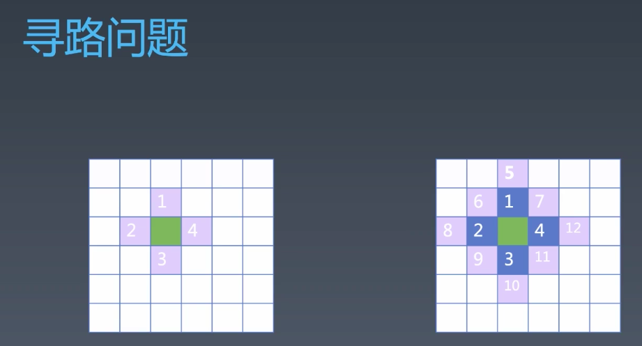
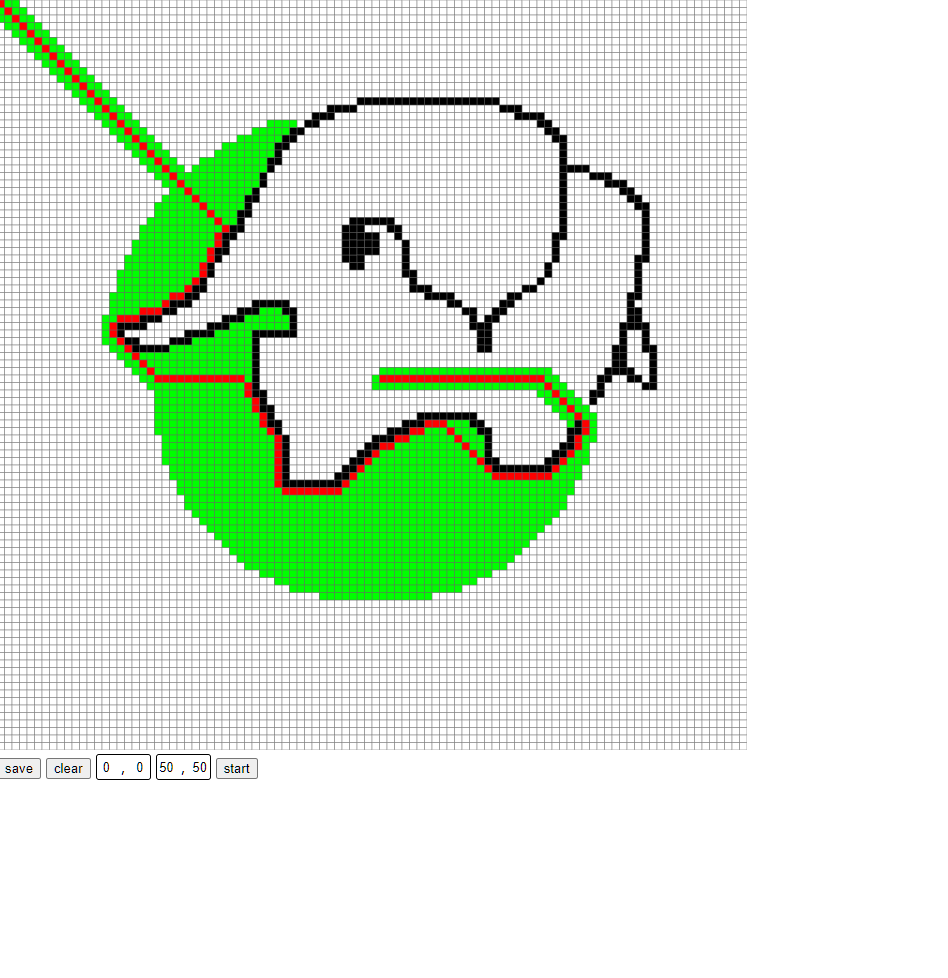

# Programming Practice

## 寻路算法



> 寻路问题本质上是在平面上的搜索问题，由起始点出发，逐渐向四周扩散，直到找到目标位置，期间可以通过一定手段简化搜索路径

### Tips

#### 画图插值

```
 function mousemoveEvent(e) {
  let distx = Math.floor(e.pageX * 2 / rect);
  let disty = Math.floor(e.pageY * 2 / rect);
  // 插值 由上一个坐标点位分别沿x,y平移逐渐填充路径
  while (distx != x || disty != y) {
    if (distx > x) {
      x++;
    } else if (distx < x) {
      x--;
    }

    if (disty > y) {
      y++;
    } else if (disty < y) {
      y--;
    }
    idx = y * width + x;
    map[idx] = isClear ? -1 : -2;
    fill([x, y], isClear ? '#fff' : '#000');
  }
}
```

#### 斜向障碍

```
// 上一个连续点位分别沿x,y平移到下一个点位上的路径都有障碍时表示该点不可达
let diffx = x - pre[0];
let diffy = y - pre[1];
if (map1[(diffy + pre[1]) * width + pre[0]] === -2 && map1[pre[1] * width + pre[0] + diffx] === -2) return;
```

#### 二叉堆排序优化最小路径

```
    class BinaryHeap {
      constructor(data, comparator) {
        this.data = data;
        this.comparator = comparator;
      }

      insert(v) {
        this.data.push(v);
        let idx = this.data.length - 1;
        let pIdx = Math.floor((idx - 1) / 2);
        while (pIdx >= 0 && this.comparator(v, this.data[pIdx]) < 0) {
          this.data[idx] = this.data[pIdx];
          this.data[pIdx] = v;
          idx = pIdx;
          pIdx = Math.floor((idx - 1) / 2);
        }
      }

      take() {
        let v = this.data[0];
        this.data[0] = this.data[this.data.length - 1];
        this.data.pop();
        let idx = 0;
        while (idx * 2 + 1 < this.data.length) {
          let leftIdx = idx * 2 + 1;
          let rightIdx = idx * 2 + 2;
          let minIdx = (rightIdx >= this.data.length) || this.comparator(this.data[leftIdx], this.data[rightIdx]) < 0 ? leftIdx : rightIdx;
          if (this.comparator(this.data[minIdx], this.data[idx]) > 0) {
            break;
          } else {
            let temp = this.data[minIdx];
            this.data[minIdx] = this.data[idx];
            this.data[idx] = temp;
          }
          idx = minIdx;
        }
        return v;
      }
    }
```

### 结果


[https://turnerxi.github.io/Frontend-01-Template/week11/path.html](https://turnerxi.github.io/Frontend-01-Template/week11/path.html)

## 正则表达式

## 补充知识

1. 启发式搜索 - 维基百科(看不懂)

   [https://zh.wikipedia.org/wiki/%E5%90%AF%E5%8F%91%E5%BC%8F%E6%90%9C%E7%B4%A2](https://zh.wikipedia.org/wiki/%E5%90%AF%E5%8F%91%E5%BC%8F%E6%90%9C%E7%B4%A2)
