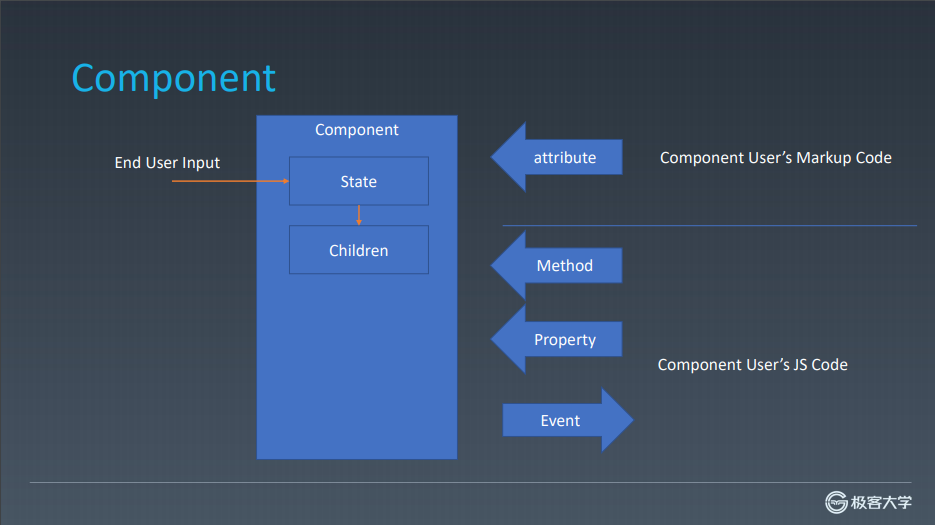
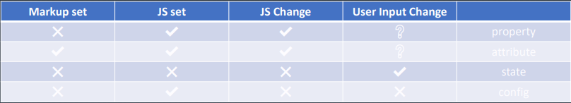
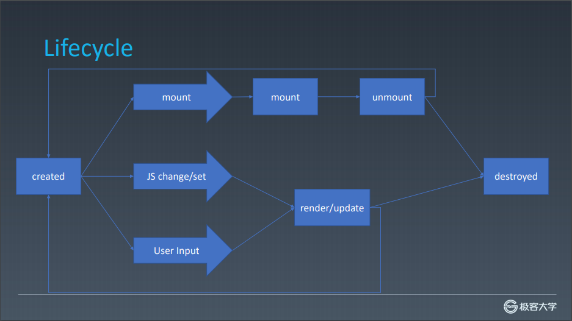

# 组件化基础

## 对象与组件

### 对象

- properties
- methods
- inherit

### 组件

- properties
  > 强调从属关系，真正作用于组件的字段，动态
- methods
- inherit
- attribute
  > 强调描述性，一般用于设置组件初始值，静态
- config
  > 组件配置，个人认为作为组件全局的配置，可以影响 properties
- state
  > 组件状态，受用户输入影响
- event
  > 组件事件，组件状态变更时的反馈
- lifecycle
  > 组件的生命周期
- children
  > content 类型的 children 和 Template 类型的 children

#### 组件架构

#### 组件状态

#### 生命周期

