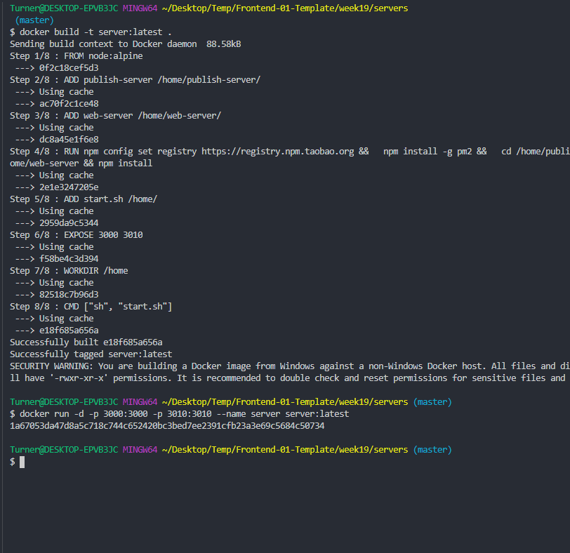
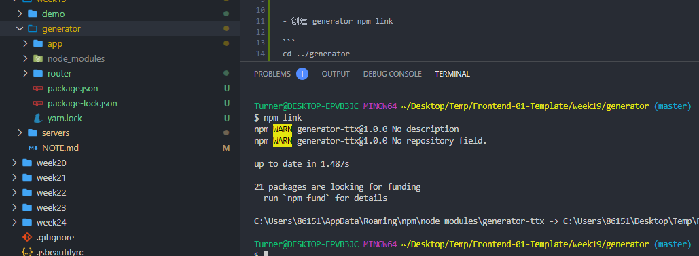
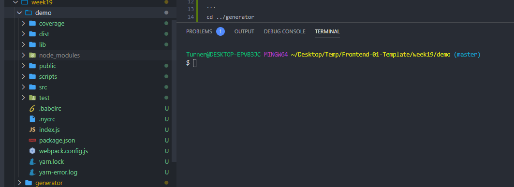
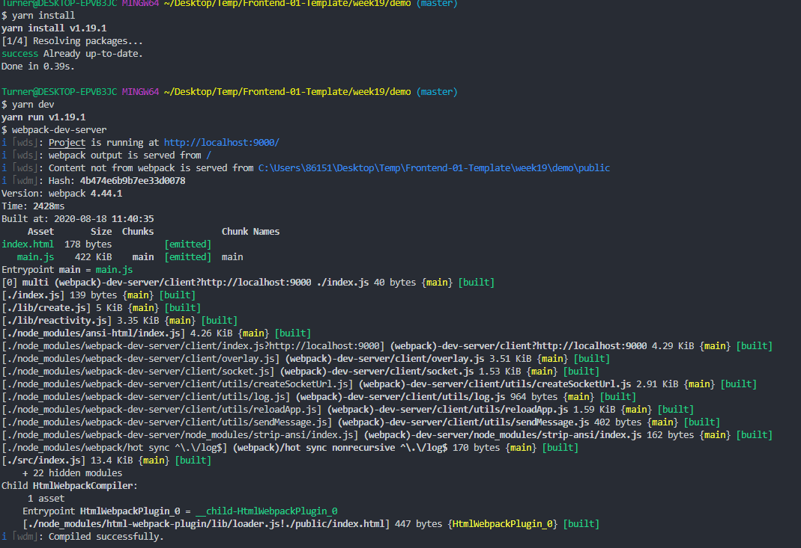
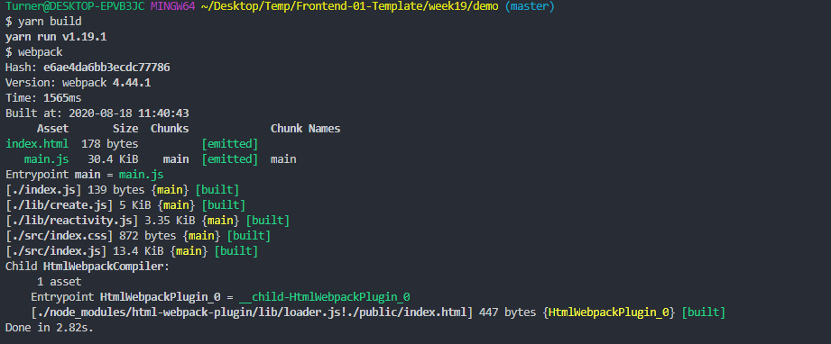
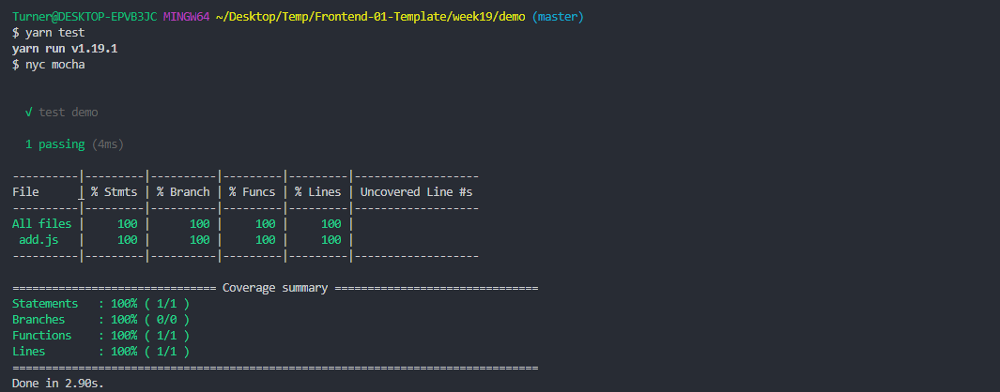
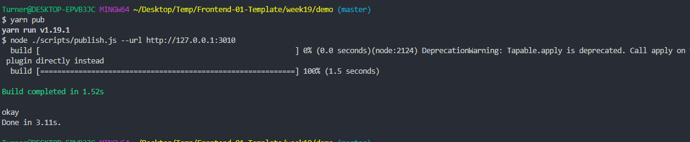

# 每周总结可以写在这里

## 创建服务端 docker 镜像, 并运行服务端
```
cd ./servers
docker build -t server:latest .
docker run -d -p 3000:3000 -p 3010:3010 --name server server:latest
```


## 创建 generator npm link
```
cd ../generator
npm install 
npm link
```


## 初始化项目
```
cd ../demo
yo ttx
```


## 运行项目
```
yarn install
yarn dev   # 运行webpack-dev-server
yarn build # 执行构建
yarn test  # 执行mocha测试
yarn pub   # 发布项目到服务端
```




